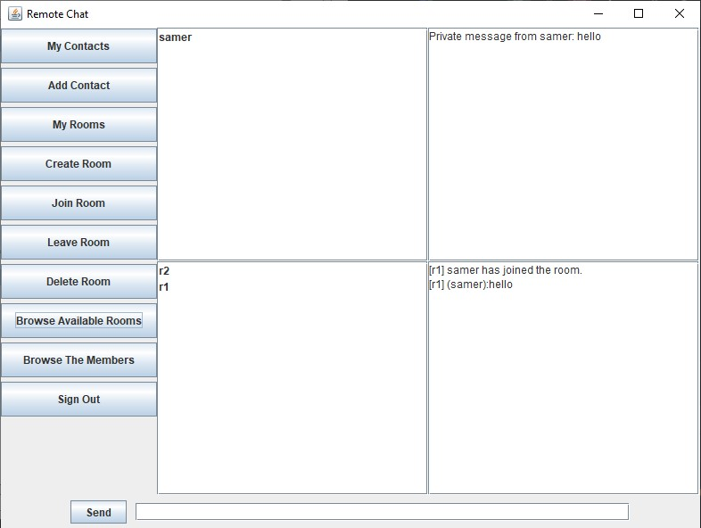

# Java RMI Chat Application

## Overview
This full-stack distributed chat system implemented using Java RMI features a Swing-based graphical client and a server that communicates over a network to manage chat rooms, user authentication, and message routing while supporting group chats, private messaging, contact management, and offline message delivery.



## Features

### Chat Client
- User authentication (sign in and sign up)
- Send and receive private messages
- Join and leave chat rooms
- Send messages to chat rooms
- Real-time updates for messages and user status
- Graphical user interface using Swing

### Chat Server
- User authentication and management
- Chat room creation, joining, and leaving
- Message routing between users and rooms
- Supports multiple concurrent users

## Project Structure

### Server-Side
```
src/
├── org/ds/
│   ├── IChatClient.java       # Client stub interface
│   ├── IChatServer.java       # Server service interface
│   ├── ChatServerImpl.java    # RMI service implementation
│   ├── User.java              # User entity class  
│   ├── Room.java              # Chat room management
│   └── Main.java              # Server bootstrap
```
### Client-Side
```
src/
├── org/ds/
│   ├── IChatClient.java       # Client callback interface
│   ├── IChatServer.java       # Server interface  
│   ├── ChatClientImpl.java    # RMI client implementation
│   ├── ClientGUI.java         # Swing interface
│   └── Main.java              # Client entry point
```
## Getting Started
Compile all Java files in both Chat-Client and Chat-Server folders.  
Start the Chat-Server by running the ChatServer class.  
Launch the Chat-Client by running the ClientMain class or ChatGUI class.  
Make sure to have the necessary RMI security policy in place.

SecurityPolicy.policy:
```
grant{
    permission java.security.AllPermission;
}
```

## Prerequisites
- Java JDK 23
- Maven
- Java RMI (included in JDK)
- Swing


## License 
[MIT License](LICENSE)
